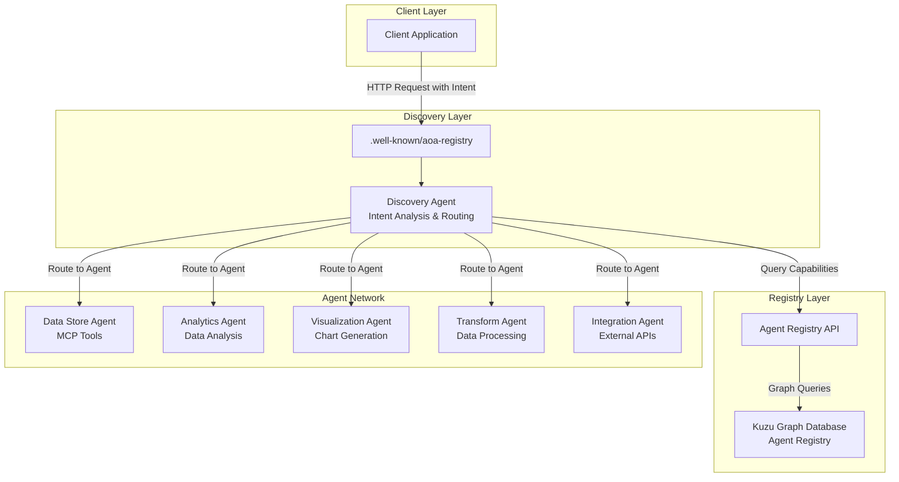

# Agent Oriented Architecture (AOA) Reference Implementation

Welcome to the Agent Oriented Architecture reference implementation repository. This project demonstrates a production-ready implementation of AOA principles using modern technologies and best practices.

## 🎯 Overview

Agent Oriented Architecture (AOA) is a software architecture pattern that enables building complex AI systems through the composition of specialized, autonomous agents. Each agent focuses on specific capabilities and can collaborate with other agents to solve complex tasks.

### Key Features

- **🔍 Dynamic Agent Discovery**: A2A protocol with `.well-known/aoa-registry` endpoint
- **🗄️ Graph-Based Registry**: Kuzu graph database for agent relationships and capabilities
- **🤖 LLM-Powered Agents**: Intent analysis and intelligent routing
- **🔧 MCP Integration**: Model Context Protocol for standardized tool usage
- **🔗 Agent Chaining**: Complex workflows through agent composition
- **📊 Production Ready**: Security, monitoring, and deployment configurations

## 📚 Documentation

### Getting Started
- [Solution Overview](SOLUTION_OVERVIEW.md) - High-level architecture and concepts
- [Implementation Plan](IMPLEMENTATION_PLAN.md) - Detailed roadmap for building AOA

### Implementation Stages
1. [Foundation - Graph Database and Registry](docs/stage1-registry.md)
2. [A2A Protocol and Discovery](docs/stage2-discovery.md)
3. [MCP Integration and Base Agent Framework](docs/stage3-mcp-framework.md)
4. [Core Agent Implementations](docs/stage4-core-agents.md)
5. [Agent Orchestration and Chaining](docs/stage5-orchestration.md)
6. [Production Features](docs/stage6-production.md)
7. [Advanced Features and Examples](docs/stage7-advanced.md)

## 🏗️ Architecture



## 🚀 Quick Start

### Prerequisites

- Python 3.11+
- Docker and Docker Compose
- Kubernetes (for production deployment)

### Local Development

```bash
# Clone the repository
git clone https://github.com/your-org/aoa.git
cd aoa

# Create virtual environment
python -m venv venv
source venv/bin/activate  # On Windows: venv\Scripts\activate

# Install dependencies
pip install -r requirements.txt

# Start infrastructure services
docker-compose up -d

# Run the registry service
python -m aoa.registry.main

# Run the discovery service
python -m aoa.discovery.main

# Run example agents
python -m aoa.agents.data_store
python -m aoa.agents.analytics
```

### Docker Deployment

```bash
# Build all images
docker-compose build

# Start all services
docker-compose up
```

## 🔧 Core Components

### 1. Agent Registry
- Kuzu graph database for storing agent metadata
- RESTful API for agent registration and discovery
- Graph queries for finding agent chains

### 2. Discovery Agent
- Natural language intent processing
- Capability extraction using LLMs
- Dynamic agent routing and orchestration

### 3. Base Agent Framework
- Abstract base class for all agents
- MCP tool integration
- Standardized communication protocols

### 4. Core Agents
- **Data Store Agent**: Database operations, file management
- **Analytics Agent**: Statistical analysis, ML inference
- **Visualization Agent**: Chart generation, dashboards
- **Transform Agent**: Data transformation, ETL
- **Integration Agent**: External API calls, webhooks

## 📖 Example Usage

### Simple Intent
```python
# Client sends intent to discovery endpoint
response = requests.post(
    "http://localhost:8001/intent",
    json={
        "intent": "Analyze last month's sales data and create a dashboard",
        "context": {"user_id": "user-123"}
    }
)

# Discovery agent automatically:
# 1. Extracts required capabilities
# 2. Finds appropriate agents
# 3. Creates execution plan
# 4. Orchestrates agent chain
# 5. Returns combined results
```

### Direct Agent Interaction
```python
# Query registry for specific capability
agents = requests.get(
    "http://localhost:8000/query",
    params={"capability": "statistical-analysis"}
).json()

# Call agent directly
result = requests.post(
    agents[0]["endpoint"] + "/execute",
    json={
        "task_type": "statistical-analysis",
        "parameters": {
            "data": [...],
            "operations": ["mean", "std", "correlation"]
        }
    }
)
```

## 🛡️ Security

- JWT and API key authentication
- Role-based access control (RBAC)
- Rate limiting and quota management
- Encryption in transit and at rest
- Comprehensive audit logging

## 📊 Monitoring

- Prometheus metrics for all components
- OpenTelemetry distributed tracing
- Health check endpoints
- Real-time performance dashboards

## 🤝 Contributing

We welcome contributions! Please see our [Contributing Guide](CONTRIBUTING.md) for details.

### Development Process
1. Fork the repository
2. Create a feature branch
3. Implement your changes
4. Add tests and documentation
5. Submit a pull request

## 📄 License

This project is licensed under the MIT License - see the [LICENSE](LICENSE) file for details.

## 🙏 Acknowledgments

- Built with [Kuzu](https://kuzudb.com/) graph database
- Powered by [FastAPI](https://fastapi.tiangolo.com/)
- MCP integration inspired by [Anthropic's Model Context Protocol](https://github.com/anthropics/model-context-protocol)

## 📞 Support

- 📧 Email: support@aoa.dev
- 💬 Discord: [Join our community](https://discord.gg/aoa)
- 🐛 Issues: [GitHub Issues](https://github.com/your-org/aoa/issues)

---

Built with ❤️ for the AI community