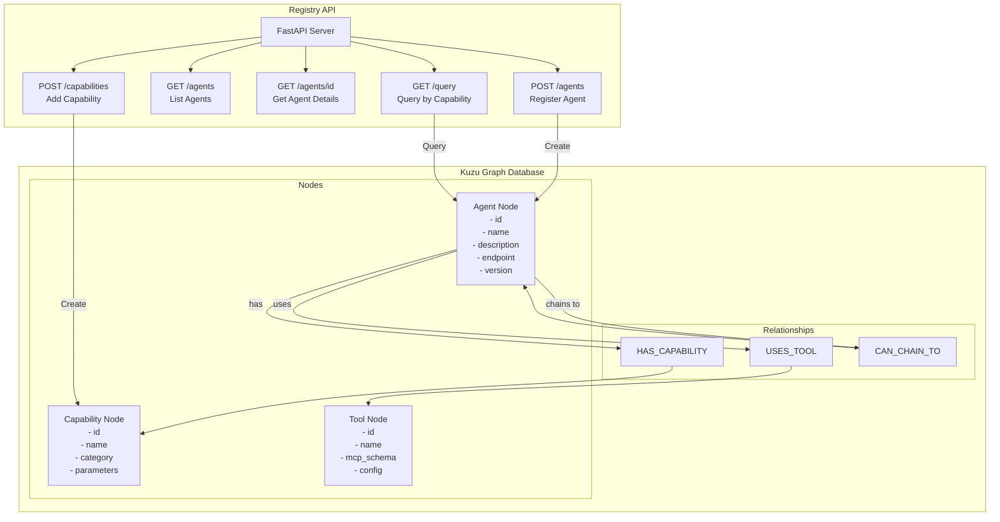

# Stage 1: Foundation - Graph Database and Registry

## Overview

Stage 1 establishes the foundation of the AOA system by implementing the agent registry using Kuzu graph database. This registry will store agent metadata, capabilities, relationships, and enable efficient querying for agent discovery.

## Architecture



## Graph Schema

### Node Types

#### Agent Node
```cypher
CREATE NODE TABLE Agent(
    id STRING PRIMARY KEY,
    name STRING NOT NULL,
    description STRING,
    endpoint STRING NOT NULL,
    version STRING DEFAULT '1.0.0',
    status STRING DEFAULT 'active',
    created_at TIMESTAMP DEFAULT NOW(),
    updated_at TIMESTAMP DEFAULT NOW(),
    config JSON
)
```

#### Capability Node
```cypher
CREATE NODE TABLE Capability(
    id STRING PRIMARY KEY,
    name STRING NOT NULL,
    category STRING NOT NULL,
    description STRING,
    input_schema JSON,
    output_schema JSON,
    examples JSON
)
```

#### Tool Node
```cypher
CREATE NODE TABLE Tool(
    id STRING PRIMARY KEY,
    name STRING NOT NULL,
    protocol STRING DEFAULT 'mcp',
    schema JSON NOT NULL,
    config JSON,
    version STRING DEFAULT '1.0.0'
)
```

### Relationship Types

#### HAS_CAPABILITY
```cypher
CREATE REL TABLE HAS_CAPABILITY(
    FROM Agent TO Capability,
    confidence FLOAT DEFAULT 1.0,
    priority INT DEFAULT 0,
    constraints JSON
)
```

#### USES_TOOL
```cypher
CREATE REL TABLE USES_TOOL(
    FROM Agent TO Tool,
    config JSON,
    required BOOLEAN DEFAULT true
)
```

#### CAN_CHAIN_TO
```cypher
CREATE REL TABLE CAN_CHAIN_TO(
    FROM Agent TO Agent,
    conditions JSON,
    data_mapping JSON,
    priority INT DEFAULT 0
)
```

## API Endpoints

### 1. Register Agent
```bash
POST /agents
Content-Type: application/json

{
  "id": "analytics-agent-001",
  "name": "Analytics Agent",
  "description": "Performs statistical analysis on datasets",
  "endpoint": "http://analytics-agent:8080",
  "version": "1.0.0",
  "config": {
    "llm_model": "gpt-4",
    "max_tokens": 2000,
    "temperature": 0.7
  }
}
```

### 2. Add Capability
```bash
POST /capabilities
Content-Type: application/json

{
  "agent_id": "analytics-agent-001",
  "capability": {
    "id": "statistical-analysis",
    "name": "Statistical Analysis",
    "category": "analytics",
    "description": "Compute statistics like mean, median, correlation",
    "input_schema": {
      "type": "object",
      "properties": {
        "dataset": {"type": "array"},
        "operations": {"type": "array", "items": {"type": "string"}}
      }
    }
  }
}
```

### 3. Query by Capability
```bash
GET /query?capability=statistical-analysis&category=analytics

Response:
{
  "agents": [
    {
      "id": "analytics-agent-001",
      "name": "Analytics Agent",
      "endpoint": "http://analytics-agent:8080",
      "capabilities": ["statistical-analysis", "data-aggregation"],
      "confidence": 0.95
    }
  ]
}
```

## Implementation Tasks

### Task 1.1: Database Setup
- [ ] Install Kuzu embedded database
- [ ] Create database initialization script
- [ ] Define schema creation queries
- [ ] Set up connection pooling

### Task 1.2: Domain Models
- [ ] Create Pydantic models for Agent, Capability, Tool
- [ ] Implement validation rules
- [ ] Define relationship models
- [ ] Create response DTOs

### Task 1.3: Registry API
- [ ] Set up FastAPI application
- [ ] Implement CRUD endpoints
- [ ] Add query endpoints with filters
- [ ] Implement graph traversal queries

### Task 1.4: Testing
- [ ] Unit tests for database operations
- [ ] Integration tests for API endpoints
- [ ] Performance tests for graph queries
- [ ] Load tests for concurrent operations

## Example Usage

### Registering a Data Store Agent
```python
import requests

# Register the agent
agent_data = {
    "id": "postgres-agent-001",
    "name": "PostgreSQL Data Store",
    "description": "Manages PostgreSQL database operations",
    "endpoint": "http://postgres-agent:8080",
    "config": {
        "connection_pool_size": 10,
        "query_timeout": 30
    }
}

response = requests.post("http://registry:8000/agents", json=agent_data)

# Add capabilities
capability_data = {
    "agent_id": "postgres-agent-001",
    "capability": {
        "id": "sql-query",
        "name": "SQL Query Execution",
        "category": "data-store",
        "input_schema": {
            "type": "object",
            "properties": {
                "query": {"type": "string"},
                "parameters": {"type": "array"}
            }
        }
    }
}

response = requests.post("http://registry:8000/capabilities", json=capability_data)
```

### Querying for Agents
```python
# Find agents that can perform data visualization
response = requests.get(
    "http://registry:8000/query",
    params={"capability": "chart-generation", "category": "visualization"}
)

agents = response.json()["agents"]
for agent in agents:
    print(f"Agent: {agent['name']} at {agent['endpoint']}")
```

## Success Metrics

1. **Performance**
   - Agent registration < 100ms
   - Capability queries < 50ms
   - Graph traversal for chains < 200ms

2. **Reliability**
   - 99.9% uptime for registry service
   - Zero data loss for agent metadata
   - Consistent query results

3. **Scalability**
   - Support 1000+ registered agents
   - Handle 100+ concurrent queries
   - Efficient graph traversal for deep chains

## Next Steps

After completing Stage 1, proceed to [Stage 2: A2A Protocol and Discovery](stage2-discovery.md) to implement the discovery layer and intent-based routing. 