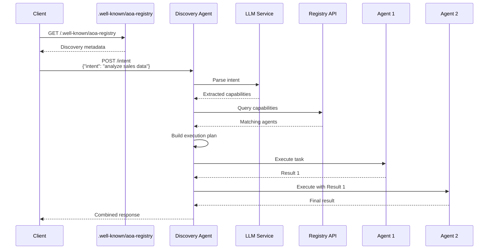
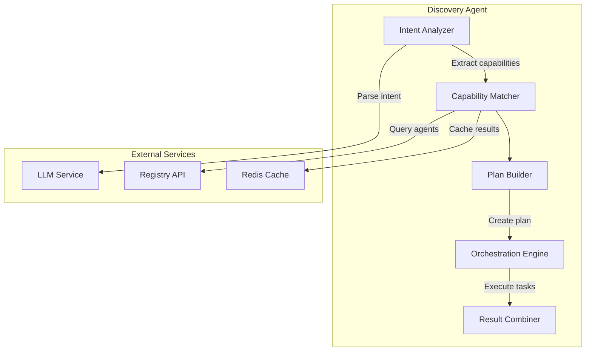

# Stage 2: A2A Protocol and Discovery

## Overview

Stage 2 implements the Agent-to-Agent (A2A) protocol and discovery mechanisms, including the `.well-known/aoa-registry` endpoint and the Discovery Agent that performs intent analysis and routing.

## A2A Protocol Specification

### Protocol Overview

The A2A protocol defines:
1. **Discovery Mechanism**: Standardized endpoints for agent discovery
2. **Capability Declaration**: How agents declare their capabilities
3. **Communication Format**: Message format for agent-to-agent communication
4. **Intent Routing**: How intents are mapped to agent capabilities

### Discovery Flow



## Well-Known Endpoint

### Endpoint: `/.well-known/aoa-registry`

```json
{
  "version": "1.0.0",
  "registry": {
    "endpoint": "http://registry:8000",
    "protocol": "http",
    "api_version": "v1"
  },
  "discovery": {
    "endpoint": "http://discovery:8001",
    "capabilities": [
      "intent-analysis",
      "agent-routing",
      "chain-orchestration"
    ]
  },
  "supported_protocols": ["http", "grpc"],
  "authentication": {
    "methods": ["bearer", "api-key"],
    "token_endpoint": "/auth/token"
  }
}
```

## Discovery Agent Architecture

### Components



## Intent Analysis

### Intent Structure

```typescript
interface Intent {
  id: string;
  text: string;
  context?: Record<string, any>;
  constraints?: {
    timeout?: number;
    budget?: number;
    priority?: 'low' | 'medium' | 'high';
  };
}
```

### Capability Extraction

The Discovery Agent uses LLM to extract required capabilities from natural language intents:

```python
async def analyze_intent(intent: str) -> List[RequiredCapability]:
    prompt = f"""
    Analyze the following intent and extract required capabilities:
    
    Intent: {intent}
    
    Return a list of capabilities needed to fulfill this intent.
    Each capability should include:
    - name: The capability name
    - category: The capability category
    - parameters: Any specific parameters needed
    
    Format as JSON array.
    """
    
    response = await llm.complete(prompt)
    return parse_capabilities(response)
```

### Example Intent Analysis

**Input Intent**: "Analyze last quarter's sales data and create a dashboard showing trends by region"

**Extracted Capabilities**:
```json
[
  {
    "name": "data-retrieval",
    "category": "data-store",
    "parameters": {
      "dataset": "sales",
      "timeframe": "last-quarter"
    }
  },
  {
    "name": "statistical-analysis",
    "category": "analytics",
    "parameters": {
      "metrics": ["trends", "aggregations"],
      "groupBy": "region"
    }
  },
  {
    "name": "dashboard-generation",
    "category": "visualization",
    "parameters": {
      "type": "dashboard",
      "charts": ["line", "bar", "map"]
    }
  }
]
```

## Agent Communication Protocol

### Request Format

```json
{
  "id": "req-123",
  "method": "execute",
  "params": {
    "task": {
      "type": "data-retrieval",
      "parameters": {
        "query": "SELECT * FROM sales WHERE quarter = 'Q4'"
      }
    },
    "context": {
      "request_id": "req-123",
      "chain_position": 1,
      "previous_results": []
    }
  },
  "metadata": {
    "timeout": 30000,
    "priority": "high"
  }
}
```

### Response Format

```json
{
  "id": "req-123",
  "status": "success",
  "result": {
    "data": [...],
    "metadata": {
      "rows_returned": 1000,
      "execution_time": 1234
    }
  },
  "next_agents": [
    {
      "id": "analytics-agent-001",
      "input_mapping": {
        "dataset": "$.result.data"
      }
    }
  ]
}
```

## Implementation Tasks

### Task 2.1: Well-Known Endpoint
- [ ] Implement `/.well-known/aoa-registry` endpoint
- [ ] Create discovery metadata structure
- [ ] Add versioning support
- [ ] Implement content negotiation

### Task 2.2: Discovery Agent Core
- [ ] Set up FastAPI application for Discovery Agent
- [ ] Implement intent analysis with LLM
- [ ] Create capability extraction logic
- [ ] Build agent matching algorithm

### Task 2.3: Communication Protocol
- [ ] Define request/response schemas
- [ ] Implement protocol serialization
- [ ] Add protocol version negotiation
- [ ] Create error handling standards

### Task 2.4: Orchestration Logic
- [ ] Implement execution plan builder
- [ ] Create parallel execution support
- [ ] Add result aggregation logic
- [ ] Implement timeout handling

## Configuration

### Discovery Agent Configuration

```yaml
discovery:
  llm:
    provider: "openai"
    model: "gpt-4"
    temperature: 0.3
    max_tokens: 2000
  
  registry:
    endpoint: "http://registry:8000"
    timeout: 5000
    retry_count: 3
  
  cache:
    provider: "redis"
    ttl: 3600
    max_entries: 10000
  
  execution:
    max_parallel_agents: 5
    default_timeout: 30000
    retry_policy:
      max_retries: 2
      backoff_multiplier: 2
```

## API Endpoints

### 1. Submit Intent
```bash
POST /intent
Content-Type: application/json

{
  "intent": "Generate monthly revenue report with year-over-year comparison",
  "context": {
    "user_id": "user-123",
    "organization": "acme-corp"
  },
  "constraints": {
    "timeout": 60000,
    "priority": "high"
  }
}

Response:
{
  "request_id": "req-456",
  "status": "processing",
  "estimated_completion": "2024-01-20T10:30:00Z",
  "plan": {
    "steps": [
      {
        "agent": "postgres-agent-001",
        "capability": "data-retrieval",
        "estimated_duration": 5000
      },
      {
        "agent": "analytics-agent-001",
        "capability": "statistical-analysis",
        "estimated_duration": 10000
      }
    ]
  }
}
```

### 2. Get Execution Status
```bash
GET /intent/{request_id}/status

Response:
{
  "request_id": "req-456",
  "status": "completed",
  "progress": {
    "completed_steps": 2,
    "total_steps": 2
  },
  "results": {
    "summary": "Revenue report generated successfully",
    "data": {...},
    "artifacts": [
      {
        "type": "report",
        "format": "pdf",
        "url": "http://storage/reports/req-456.pdf"
      }
    ]
  }
}
```

## Testing Strategy

### Unit Tests
- Intent parsing accuracy
- Capability extraction logic
- Plan building algorithms
- Protocol serialization

### Integration Tests
- End-to-end intent processing
- Multi-agent orchestration
- Error handling and recovery
- Timeout management

### Performance Tests
- Intent analysis latency
- Concurrent request handling
- Cache effectiveness
- LLM response times

## Success Metrics

1. **Intent Analysis**
   - 95% accuracy in capability extraction
   - < 500ms average analysis time
   - Support for complex multi-step intents

2. **Discovery Performance**
   - < 100ms agent discovery time
   - 99.9% cache hit rate for common queries
   - Support for 100+ concurrent intents

3. **Orchestration Efficiency**
   - < 10% overhead for orchestration
   - Successful completion rate > 95%
   - Graceful handling of agent failures

## Next Steps

After completing Stage 2, proceed to [Stage 3: MCP Integration and Base Agent Framework](stage3-mcp-framework.md) to build the foundation for individual agents. 