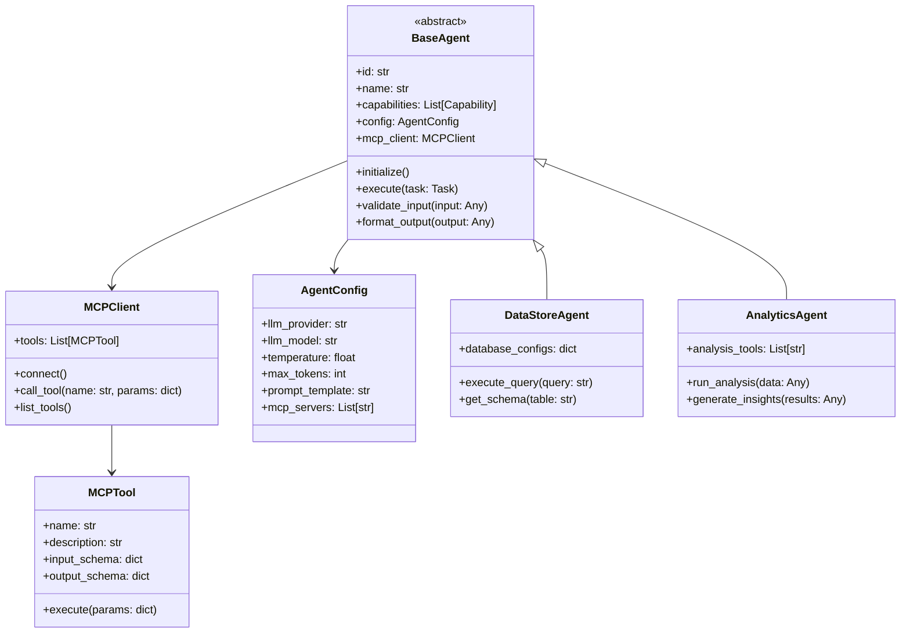
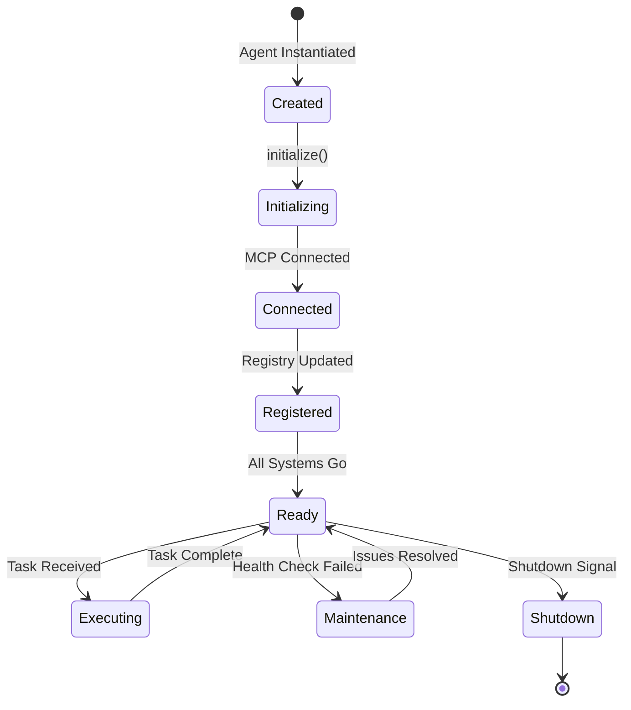

# Stage 3: MCP Integration and Base Agent Framework

## Overview

Stage 3 establishes the foundation for building individual agents by creating a base agent framework and integrating the Model Context Protocol (MCP). This provides a standardized way to create agents with consistent interfaces and MCP tool capabilities.

## Base Agent Architecture



## Model Context Protocol (MCP) Integration

### MCP Overview

MCP provides a standardized way for agents to:
- Discover and use tools dynamically
- Maintain context across tool invocations
- Handle complex multi-step operations
- Ensure type safety and validation

### MCP Tool Definition

```python
from typing import Dict, Any, Optional
from pydantic import BaseModel, Field

class MCPToolSchema(BaseModel):
    name: str = Field(..., description="Tool name")
    description: str = Field(..., description="Tool description")
    parameters: Dict[str, Any] = Field(..., description="JSON Schema for parameters")
    returns: Dict[str, Any] = Field(..., description="JSON Schema for return value")

class MCPTool:
    def __init__(self, schema: MCPToolSchema):
        self.schema = schema
        
    async def execute(self, params: Dict[str, Any]) -> Dict[str, Any]:
        """Execute the tool with given parameters"""
        raise NotImplementedError
```

### Example MCP Tools

#### Database Query Tool
```python
class DatabaseQueryTool(MCPTool):
    schema = MCPToolSchema(
        name="database_query",
        description="Execute SQL queries against configured databases",
        parameters={
            "type": "object",
            "properties": {
                "database": {"type": "string", "description": "Database identifier"},
                "query": {"type": "string", "description": "SQL query to execute"},
                "parameters": {"type": "array", "description": "Query parameters"}
            },
            "required": ["database", "query"]
        },
        returns={
            "type": "object",
            "properties": {
                "rows": {"type": "array", "description": "Query results"},
                "row_count": {"type": "integer", "description": "Number of rows"},
                "execution_time": {"type": "number", "description": "Query execution time in ms"}
            }
        }
    )
    
    async def execute(self, params: Dict[str, Any]) -> Dict[str, Any]:
        # Implementation details
        pass
```

#### Data Analysis Tool
```python
class StatisticalAnalysisTool(MCPTool):
    schema = MCPToolSchema(
        name="statistical_analysis",
        description="Perform statistical analysis on datasets",
        parameters={
            "type": "object",
            "properties": {
                "data": {"type": "array", "description": "Dataset to analyze"},
                "operations": {
                    "type": "array",
                    "items": {"type": "string"},
                    "description": "Statistical operations to perform"
                }
            },
            "required": ["data", "operations"]
        },
        returns={
            "type": "object",
            "properties": {
                "results": {"type": "object", "description": "Analysis results"},
                "summary": {"type": "string", "description": "Summary of findings"}
            }
        }
    )
```

## Base Agent Implementation

### Abstract Base Agent

```python
from abc import ABC, abstractmethod
from typing import List, Dict, Any, Optional
import asyncio
from pydantic import BaseModel

class Task(BaseModel):
    id: str
    type: str
    parameters: Dict[str, Any]
    context: Optional[Dict[str, Any]] = None

class TaskResult(BaseModel):
    task_id: str
    status: str  # success, failure, partial
    data: Any
    metadata: Dict[str, Any]
    errors: Optional[List[str]] = None

class BaseAgent(ABC):
    def __init__(self, agent_id: str, config: AgentConfig):
        self.id = agent_id
        self.config = config
        self.mcp_client = MCPClient(config.mcp_servers)
        self.llm_client = self._create_llm_client()
        self.capabilities = []
        
    async def initialize(self):
        """Initialize agent and connect to MCP servers"""
        await self.mcp_client.connect()
        self.capabilities = await self._discover_capabilities()
        await self._register_with_registry()
        
    @abstractmethod
    async def execute(self, task: Task) -> TaskResult:
        """Execute a task and return results"""
        pass
        
    async def validate_input(self, task: Task) -> bool:
        """Validate task input against capabilities"""
        # Check if task type matches agent capabilities
        if task.type not in [cap.name for cap in self.capabilities]:
            return False
        
        # Validate parameters against schema
        capability = next(c for c in self.capabilities if c.name == task.type)
        return self._validate_against_schema(task.parameters, capability.input_schema)
        
    def format_output(self, raw_output: Any) -> TaskResult:
        """Format raw output into standardized TaskResult"""
        return TaskResult(
            task_id=self.current_task_id,
            status="success",
            data=raw_output,
            metadata={
                "agent_id": self.id,
                "execution_time": self.execution_time,
                "tools_used": self.tools_used
            }
        )
        
    async def _execute_with_llm(self, prompt: str) -> str:
        """Execute task using LLM with MCP tools"""
        messages = [
            {"role": "system", "content": self.config.prompt_template},
            {"role": "user", "content": prompt}
        ]
        
        # Get available tools from MCP
        tools = await self.mcp_client.list_tools()
        
        response = await self.llm_client.complete(
            messages=messages,
            tools=tools,
            temperature=self.config.temperature,
            max_tokens=self.config.max_tokens
        )
        
        return response
```

### Agent Configuration

```python
from pydantic import BaseModel, Field
from typing import List, Optional

class LLMConfig(BaseModel):
    provider: str = Field(..., description="LLM provider (openai, anthropic)")
    model: str = Field(..., description="Model identifier")
    api_key: str = Field(..., description="API key for the provider")
    temperature: float = Field(0.7, description="Temperature for generation")
    max_tokens: int = Field(2000, description="Maximum tokens to generate")

class AgentConfig(BaseModel):
    name: str
    description: str
    llm: LLMConfig
    mcp_servers: List[str] = Field(..., description="MCP server endpoints")
    prompt_template: str = Field(..., description="System prompt template")
    capabilities: List[str] = Field(..., description="List of capability IDs")
    metadata: Optional[Dict[str, Any]] = None
```

## Agent Lifecycle Management

### Lifecycle States



### Health Monitoring

```python
class AgentHealthMonitor:
    def __init__(self, agent: BaseAgent):
        self.agent = agent
        self.health_checks = {
            "mcp_connection": self._check_mcp_connection,
            "llm_availability": self._check_llm_availability,
            "memory_usage": self._check_memory_usage,
            "task_queue": self._check_task_queue
        }
        
    async def run_health_checks(self) -> Dict[str, bool]:
        results = {}
        for check_name, check_func in self.health_checks.items():
            try:
                results[check_name] = await check_func()
            except Exception as e:
                results[check_name] = False
                logger.error(f"Health check {check_name} failed: {e}")
        return results
```

## Implementation Tasks

### Task 3.1: Base Agent Framework
- [ ] Create abstract BaseAgent class
- [ ] Implement agent lifecycle management
- [ ] Add configuration management system
- [ ] Create agent registry client

### Task 3.2: MCP Integration
- [ ] Implement MCP client library
- [ ] Create tool discovery mechanism
- [ ] Add tool execution framework
- [ ] Implement context management

### Task 3.3: LLM Integration
- [ ] Create LLM client abstraction
- [ ] Implement provider adapters (OpenAI, Anthropic)
- [ ] Add prompt management system
- [ ] Create response parsing utilities

### Task 3.4: Testing Framework
- [ ] Create mock MCP server for testing
- [ ] Implement agent testing utilities
- [ ] Add integration test suite
- [ ] Create performance benchmarks

## Example Agent Implementation

### Simple Data Store Agent

```python
class DataStoreAgent(BaseAgent):
    def __init__(self, agent_id: str, config: AgentConfig):
        super().__init__(agent_id, config)
        self.database_configs = {}
        
    async def execute(self, task: Task) -> TaskResult:
        """Execute data store operations"""
        try:
            # Validate input
            if not await self.validate_input(task):
                return TaskResult(
                    task_id=task.id,
                    status="failure",
                    data=None,
                    errors=["Invalid task parameters"]
                )
            
            # Build prompt for LLM
            prompt = f"""
            Execute the following data operation:
            Type: {task.type}
            Parameters: {json.dumps(task.parameters)}
            
            Use the available MCP tools to complete this task.
            """
            
            # Execute with LLM and MCP tools
            result = await self._execute_with_llm(prompt)
            
            # Format and return result
            return self.format_output(result)
            
        except Exception as e:
            return TaskResult(
                task_id=task.id,
                status="failure",
                data=None,
                errors=[str(e)]
            )
```

## Configuration Examples

### Agent Configuration File

```yaml
agent:
  id: "postgres-agent-001"
  name: "PostgreSQL Data Store Agent"
  description: "Handles PostgreSQL database operations"
  
  llm:
    provider: "openai"
    model: "gpt-4"
    temperature: 0.3
    max_tokens: 2000
    
  mcp_servers:
    - "localhost:5000"  # PostgreSQL MCP server
    - "localhost:5001"  # Schema analysis MCP server
    
  prompt_template: |
    You are a PostgreSQL database expert agent. Your role is to:
    1. Execute SQL queries safely and efficiently
    2. Provide clear explanations of query results
    3. Suggest optimizations when appropriate
    
    Always use the provided MCP tools for database operations.
    Never execute destructive operations without explicit confirmation.
    
  capabilities:
    - "sql-query"
    - "schema-inspection"
    - "data-export"
    - "performance-analysis"
```

## Success Metrics

1. **Framework Completeness**
   - All base agent methods implemented
   - MCP integration fully functional
   - LLM providers supported

2. **Developer Experience**
   - < 30 minutes to create new agent
   - Clear documentation and examples
   - Comprehensive error messages

3. **Performance**
   - < 100ms agent initialization
   - < 50ms MCP tool discovery
   - Efficient context management

## Next Steps

After completing Stage 3, proceed to [Stage 4: Core Agent Implementations](stage4-core-agents.md) to build the specific agent types using this framework. 