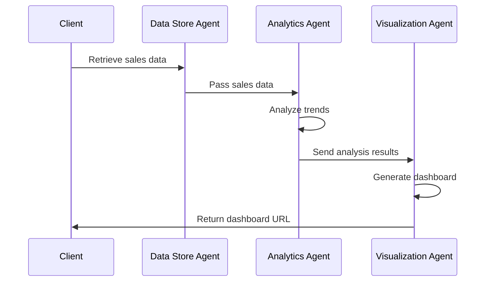
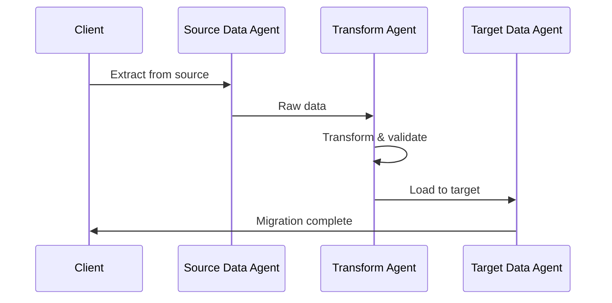

# Stage 4: Core Agent Implementations

## Overview

Stage 4 implements the core agent types that form the foundation of the AOA system. Each agent is specialized for specific tasks and uses MCP tools to execute operations.

## Core Agent Types

```mermaid
graph TB
    subgraph "Core Agents"
        DA[Data Store Agent]
        AA[Analytics Agent]
        VA[Visualization Agent]
        TA[Transform Agent]
        IA[Integration Agent]
    end
    
    subgraph "MCP Tools"
        subgraph "Data Store Tools"
            SQL[SQL Query]
            NoSQL[NoSQL Query]
            FS[File System]
        end
        
        subgraph "Analytics Tools"
            STAT[Statistics]
            ML[ML Inference]
            AGG[Aggregation]
        end
        
        subgraph "Visualization Tools"
            CHART[Chart Generator]
            DASH[Dashboard Builder]
            REP[Report Formatter]
        end
        
        subgraph "Transform Tools"
            ETL[ETL Pipeline]
            MAP[Schema Mapper]
            VAL[Validator]
        end
        
        subgraph "Integration Tools"
            API[API Client]
            WH[Webhook Handler]
            EVT[Event Processor]
        end
    end
    
    DA --> SQL
    DA --> NoSQL
    DA --> FS
    
    AA --> STAT
    AA --> ML
    AA --> AGG
    
    VA --> CHART
    VA --> DASH
    VA --> REP
    
    TA --> ETL
    TA --> MAP
    TA --> VAL
    
    IA --> API
    IA --> WH
    IA --> EVT
```



## Data Store Agent

### Purpose
Manages all data storage and retrieval operations across different database types.

### Capabilities
- SQL query execution
- NoSQL document operations
- File system management
- Schema inspection
- Data export/import

### Implementation
```python
class DataStoreAgent(BaseAgent):
    """Agent specialized in data storage operations"""
    
    capabilities = [
        Capability(
            name="sql-query",
            category="data-store",
            description="Execute SQL queries on relational databases"
        ),
        Capability(
            name="document-query",
            category="data-store",
            description="Query NoSQL document stores"
        ),
        Capability(
            name="file-operations",
            category="data-store",
            description="Manage file system operations"
        )
    ]
    
    async def execute(self, task: Task) -> TaskResult:
        if task.type == "sql-query":
            return await self._execute_sql_query(task)
        elif task.type == "document-query":
            return await self._execute_document_query(task)
        elif task.type == "file-operations":
            return await self._execute_file_operation(task)
```

### MCP Tools
```yaml
mcp_tools:
  - name: postgresql_query
    description: Execute PostgreSQL queries
    server: postgresql-mcp-server:5432
    
  - name: mongodb_query
    description: Execute MongoDB queries
    server: mongodb-mcp-server:27017
    
  - name: s3_operations
    description: AWS S3 file operations
    server: s3-mcp-server:9000
```

## Analytics Agent

### Purpose
Performs data analysis, statistical computations, and machine learning inference.

### Capabilities
- Statistical analysis
- Time series analysis
- Machine learning inference
- Data aggregation
- Pattern recognition

### Implementation
```python
class AnalyticsAgent(BaseAgent):
    """Agent specialized in data analysis and insights"""
    
    capabilities = [
        Capability(
            name="statistical-analysis",
            category="analytics",
            description="Compute statistical metrics and distributions"
        ),
        Capability(
            name="ml-inference",
            category="analytics",
            description="Run machine learning models for predictions"
        ),
        Capability(
            name="pattern-detection",
            category="analytics",
            description="Identify patterns and anomalies in data"
        )
    ]
    
    prompt_template = """
    You are an expert data analyst. Analyze the provided data and:
    1. Identify key insights and patterns
    2. Compute relevant statistical metrics
    3. Provide actionable recommendations
    4. Explain findings in clear, business-friendly language
    """
```

## Visualization Agent

### Purpose
Creates visual representations of data including charts, dashboards, and reports.

### Capabilities
- Chart generation (line, bar, pie, scatter, etc.)
- Interactive dashboard creation
- Report formatting (PDF, HTML)
- Data storytelling

### MCP Tools
```python
visualization_tools = [
    {
        "name": "plotly_chart",
        "description": "Generate interactive Plotly charts",
        "parameters": {
            "data": "array",
            "chart_type": "string",
            "layout": "object"
        }
    },
    {
        "name": "dashboard_builder",
        "description": "Create multi-chart dashboards",
        "parameters": {
            "charts": "array",
            "layout": "string",
            "theme": "string"
        }
    }
]
```

## Transform Agent

### Purpose
Handles data transformation, ETL processes, and format conversions.

### Capabilities
- Data format conversion (CSV, JSON, XML, Parquet)
- Schema mapping and transformation
- Data validation and cleansing
- ETL pipeline execution

### Example Transformation
```python
async def transform_data(self, source_format: str, target_format: str, data: Any):
    """Transform data between formats"""
    
    # Use MCP tools for transformation
    result = await self.mcp_client.call_tool(
        "format_converter",
        {
            "source_format": source_format,
            "target_format": target_format,
            "data": data,
            "options": {
                "validate": True,
                "preserve_types": True
            }
        }
    )
    
    return result
```

## Integration Agent

### Purpose
Manages external API integrations, webhooks, and event processing.

### Capabilities
- REST API calls
- GraphQL queries
- Webhook handling
- Event stream processing
- Authentication management

### Configuration
```yaml
integration_agent:
  apis:
    - name: salesforce
      type: rest
      base_url: https://api.salesforce.com
      auth: oauth2
      
    - name: stripe
      type: rest
      base_url: https://api.stripe.com
      auth: api_key
      
    - name: github
      type: graphql
      endpoint: https://api.github.com/graphql
      auth: token
```

## Agent Chaining Examples

### Example 1: Sales Analysis Dashboard


### Example 2: Data Migration Pipeline


## Implementation Tasks

### Task 4.1: Data Store Agent
- [ ] Implement SQL query execution
- [ ] Add NoSQL support
- [ ] Create file system operations
- [ ] Add transaction support

### Task 4.2: Analytics Agent
- [ ] Implement statistical functions
- [ ] Add ML model integration
- [ ] Create aggregation pipelines
- [ ] Add time series analysis

### Task 4.3: Visualization Agent
- [ ] Implement chart generation
- [ ] Create dashboard builder
- [ ] Add report templates
- [ ] Support export formats

### Task 4.4: Transform Agent
- [ ] Implement format converters
- [ ] Create schema mappers
- [ ] Add validation rules
- [ ] Build ETL pipelines

### Task 4.5: Integration Agent
- [ ] Implement API clients
- [ ] Add authentication handlers
- [ ] Create webhook receivers
- [ ] Build retry logic

## Testing Strategy

### Unit Tests
```python
async def test_data_store_agent_sql_query():
    agent = DataStoreAgent("test-agent", test_config)
    task = Task(
        id="test-1",
        type="sql-query",
        parameters={
            "database": "test_db",
            "query": "SELECT * FROM users LIMIT 10"
        }
    )
    
    result = await agent.execute(task)
    assert result.status == "success"
    assert len(result.data) <= 10
```

### Integration Tests
- End-to-end agent chains
- Cross-agent data passing
- Error propagation
- Performance under load

## Next Steps

After completing Stage 4, proceed to [Stage 5: Agent Orchestration and Chaining](stage5-orchestration.md) to implement complex workflows. 