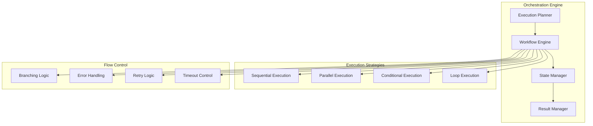

# Stage 5: Agent Orchestration and Chaining

## Overview

Stage 5 implements the orchestration layer that enables complex agent chaining, parallel execution, and sophisticated workflow management.

## Orchestration Architecture



## Execution Plan Structure

### Plan Definition
```python
from typing import List, Dict, Any, Optional
from pydantic import BaseModel
from enum import Enum

class ExecutionStrategy(Enum):
    SEQUENTIAL = "sequential"
    PARALLEL = "parallel"
    CONDITIONAL = "conditional"
    LOOP = "loop"

class AgentStep(BaseModel):
    step_id: str
    agent_id: str
    task_type: str
    parameters: Dict[str, Any]
    dependencies: List[str] = []
    condition: Optional[str] = None
    retry_policy: Optional[Dict[str, Any]] = None
    timeout: Optional[int] = None

class ExecutionPlan(BaseModel):
    plan_id: str
    intent: str
    steps: List[AgentStep]
    strategy: ExecutionStrategy
    metadata: Dict[str, Any] = {}
```

## Workflow Engine

### Core Implementation
```python
class WorkflowEngine:
    def __init__(self, registry_client: RegistryClient):
        self.registry = registry_client
        self.state_manager = StateManager()
        self.result_manager = ResultManager()
        
    async def execute_plan(self, plan: ExecutionPlan) -> WorkflowResult:
        """Execute a complete workflow plan"""
        
        # Initialize workflow state
        workflow_state = self.state_manager.create_workflow(plan.plan_id)
        
        try:
            if plan.strategy == ExecutionStrategy.SEQUENTIAL:
                result = await self._execute_sequential(plan, workflow_state)
            elif plan.strategy == ExecutionStrategy.PARALLEL:
                result = await self._execute_parallel(plan, workflow_state)
            elif plan.strategy == ExecutionStrategy.CONDITIONAL:
                result = await self._execute_conditional(plan, workflow_state)
            else:
                raise ValueError(f"Unknown strategy: {plan.strategy}")
                
            return self.result_manager.compile_results(workflow_state)
            
        except Exception as e:
            await self._handle_workflow_error(workflow_state, e)
            raise
```

### Sequential Execution
```python
async def _execute_sequential(self, plan: ExecutionPlan, state: WorkflowState):
    """Execute steps one after another"""
    
    for step in plan.steps:
        # Check dependencies
        if not self._dependencies_met(step, state):
            raise DependencyError(f"Dependencies not met for {step.step_id}")
            
        # Get agent
        agent = await self._get_agent(step.agent_id)
        
        # Prepare task with previous results
        task = self._prepare_task(step, state)
        
        # Execute with retry logic
        result = await self._execute_with_retry(
            agent, task, step.retry_policy
        )
        
        # Update state
        state.add_result(step.step_id, result)
```

### Parallel Execution
```python
async def _execute_parallel(self, plan: ExecutionPlan, state: WorkflowState):
    """Execute independent steps in parallel"""
    
    # Group steps by dependencies
    dependency_levels = self._analyze_dependencies(plan.steps)
    
    for level in dependency_levels:
        # Execute all steps at this level in parallel
        tasks = []
        for step in level:
            agent = await self._get_agent(step.agent_id)
            task = self._prepare_task(step, state)
            tasks.append(self._execute_with_retry(agent, task, step.retry_policy))
            
        # Wait for all tasks at this level
        results = await asyncio.gather(*tasks, return_exceptions=True)
        
        # Update state with results
        for step, result in zip(level, results):
            if isinstance(result, Exception):
                await self._handle_step_error(step, result, state)
            else:
                state.add_result(step.step_id, result)
```

## State Management

### Workflow State
```python
class WorkflowState:
    def __init__(self, workflow_id: str):
        self.workflow_id = workflow_id
        self.status = "running"
        self.steps_completed = []
        self.results = {}
        self.errors = []
        self.start_time = datetime.utcnow()
        
    def add_result(self, step_id: str, result: TaskResult):
        """Add step result to state"""
        self.results[step_id] = result
        self.steps_completed.append(step_id)
        
    def get_previous_results(self, dependencies: List[str]) -> Dict[str, Any]:
        """Get results from dependent steps"""
        return {dep: self.results.get(dep) for dep in dependencies}
```

## Advanced Orchestration Features

### Conditional Execution
```python
class ConditionalExecutor:
    async def evaluate_condition(
        self, 
        condition: str, 
        context: Dict[str, Any]
    ) -> bool:
        """Evaluate condition using expression language"""
        
        # Simple expression evaluation
        # In production, use a proper expression evaluator
        try:
            return eval(condition, {"__builtins__": {}}, context)
        except Exception:
            return False
            
    async def execute_conditional_step(
        self,
        step: AgentStep,
        state: WorkflowState
    ) -> Optional[TaskResult]:
        """Execute step only if condition is met"""
        
        if step.condition:
            context = {
                "results": state.results,
                "metadata": state.metadata
            }
            
            if not await self.evaluate_condition(step.condition, context):
                return None
                
        # Proceed with execution
        return await self.execute_step(step)
```

### Loop Execution
```python
class LoopExecutor:
    async def execute_loop(
        self,
        loop_config: Dict[str, Any],
        steps: List[AgentStep],
        state: WorkflowState
    ) -> List[TaskResult]:
        """Execute steps in a loop"""
        
        results = []
        
        if loop_config["type"] == "for_each":
            items = loop_config["items"]
            for item in items:
                # Execute steps with current item
                loop_state = state.create_loop_iteration(item)
                for step in steps:
                    result = await self.execute_step(step, loop_state)
                    results.append(result)
                    
        elif loop_config["type"] == "while":
            condition = loop_config["condition"]
            while await self.evaluate_condition(condition, state.to_dict()):
                for step in steps:
                    result = await self.execute_step(step, state)
                    results.append(result)
                    
        return results
```

## Error Handling and Recovery

### Retry Strategies
```python
class RetryStrategy:
    def __init__(self, config: Dict[str, Any]):
        self.max_retries = config.get("max_retries", 3)
        self.backoff_type = config.get("backoff_type", "exponential")
        self.initial_delay = config.get("initial_delay", 1)
        
    async def execute_with_retry(
        self,
        func: Callable,
        *args,
        **kwargs
    ) -> Any:
        """Execute function with retry logic"""
        
        for attempt in range(self.max_retries):
            try:
                return await func(*args, **kwargs)
            except Exception as e:
                if attempt == self.max_retries - 1:
                    raise
                    
                delay = self.calculate_delay(attempt)
                await asyncio.sleep(delay)
```

### Circuit Breaker
```python
class CircuitBreaker:
    def __init__(self, failure_threshold: int = 5, reset_timeout: int = 60):
        self.failure_threshold = failure_threshold
        self.reset_timeout = reset_timeout
        self.failure_count = 0
        self.last_failure = None
        self.state = "closed"  # closed, open, half-open
        
    async def call(self, func: Callable, *args, **kwargs):
        """Execute function with circuit breaker protection"""
        
        if self.state == "open":
            if self._should_attempt_reset():
                self.state = "half-open"
            else:
                raise CircuitOpenError("Circuit breaker is open")
                
        try:
            result = await func(*args, **kwargs)
            self._on_success()
            return result
        except Exception as e:
            self._on_failure()
            raise
```

## Result Aggregation

### Result Manager
```python
class ResultManager:
    def compile_results(self, workflow_state: WorkflowState) -> WorkflowResult:
        """Compile all step results into final workflow result"""
        
        # Aggregate data from all steps
        aggregated_data = self._aggregate_data(workflow_state.results)
        
        # Generate summary
        summary = self._generate_summary(aggregated_data)
        
        # Create artifacts
        artifacts = self._create_artifacts(aggregated_data)
        
        return WorkflowResult(
            workflow_id=workflow_state.workflow_id,
            status="completed",
            summary=summary,
            data=aggregated_data,
            artifacts=artifacts,
            execution_time=self._calculate_execution_time(workflow_state),
            steps_executed=len(workflow_state.steps_completed)
        )
```

## Monitoring and Observability

### Execution Monitoring
```python
class ExecutionMonitor:
    def __init__(self):
        self.metrics = {}
        self.traces = []
        
    async def monitor_execution(self, plan: ExecutionPlan):
        """Monitor workflow execution"""
        
        with self.create_trace(plan.plan_id) as trace:
            # Track execution metrics
            trace.set_attribute("plan.intent", plan.intent)
            trace.set_attribute("plan.strategy", plan.strategy.value)
            trace.set_attribute("plan.steps", len(plan.steps))
            
            # Monitor each step
            for step in plan.steps:
                with trace.create_span(f"step.{step.step_id}"):
                    # Record step metrics
                    pass
```

## Implementation Tasks

### Task 5.1: Execution Planning
- [ ] Implement execution plan builder
- [ ] Create dependency analyzer
- [ ] Add strategy selector
- [ ] Build plan validator

### Task 5.2: Workflow Engine
- [ ] Implement sequential executor
- [ ] Create parallel executor
- [ ] Add conditional logic
- [ ] Build loop support

### Task 5.3: State Management
- [ ] Create state manager
- [ ] Implement state persistence
- [ ] Add state recovery
- [ ] Build state queries

### Task 5.4: Error Handling
- [ ] Implement retry strategies
- [ ] Create circuit breaker
- [ ] Add error recovery
- [ ] Build fallback mechanisms

### Task 5.5: Monitoring
- [ ] Add execution monitoring
- [ ] Create performance metrics
- [ ] Implement tracing
- [ ] Build alerting system

## Next Steps

After completing Stage 5, proceed to [Stage 6: Production Features](stage6-production.md) to add enterprise-ready capabilities. 