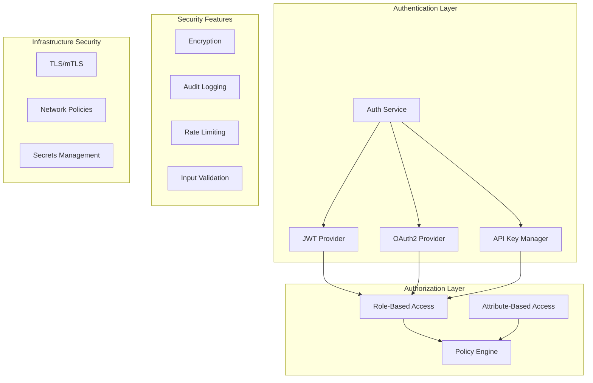

# Stage 6: Production Features

## Overview

Stage 6 adds enterprise-ready features including security, authentication, monitoring, and deployment configurations to make the AOA system production-ready.

## Security Architecture



## Authentication Implementation

### JWT Authentication
```python
from fastapi import Depends, HTTPException, Security
from fastapi.security import HTTPBearer, HTTPAuthorizationCredentials
import jwt
from datetime import datetime, timedelta

class JWTAuth:
    def __init__(self, secret_key: str, algorithm: str = "HS256"):
        self.secret_key = secret_key
        self.algorithm = algorithm
        self.security = HTTPBearer()
        
    def create_token(self, user_id: str, roles: List[str]) -> str:
        """Create JWT token"""
        payload = {
            "sub": user_id,
            "roles": roles,
            "exp": datetime.utcnow() + timedelta(hours=24),
            "iat": datetime.utcnow()
        }
        return jwt.encode(payload, self.secret_key, algorithm=self.algorithm)
        
    async def verify_token(
        self, 
        credentials: HTTPAuthorizationCredentials = Security(HTTPBearer())
    ) -> Dict[str, Any]:
        """Verify JWT token"""
        token = credentials.credentials
        
        try:
            payload = jwt.decode(
                token, 
                self.secret_key, 
                algorithms=[self.algorithm]
            )
            return payload
        except jwt.ExpiredSignatureError:
            raise HTTPException(status_code=401, detail="Token expired")
        except jwt.InvalidTokenError:
            raise HTTPException(status_code=401, detail="Invalid token")
```

### API Key Authentication
```python
class APIKeyAuth:
    def __init__(self, storage: KeyStorage):
        self.storage = storage
        
    async def verify_api_key(
        self, 
        api_key: str = Header(None, alias="X-API-Key")
    ) -> Dict[str, Any]:
        """Verify API key"""
        if not api_key:
            raise HTTPException(status_code=401, detail="API key required")
            
        key_info = await self.storage.get_key_info(api_key)
        if not key_info or not key_info.is_active:
            raise HTTPException(status_code=401, detail="Invalid API key")
            
        # Update last used timestamp
        await self.storage.update_last_used(api_key)
        
        return {
            "client_id": key_info.client_id,
            "scopes": key_info.scopes,
            "rate_limit": key_info.rate_limit
        }
```

## Authorization and Access Control

### Role-Based Access Control (RBAC)
```python
class RBACPolicy:
    def __init__(self):
        self.role_permissions = {
            "admin": ["*"],
            "developer": [
                "agents:read",
                "agents:execute",
                "workflows:create",
                "workflows:execute"
            ],
            "viewer": [
                "agents:read",
                "workflows:read"
            ]
        }
        
    def check_permission(
        self, 
        user_roles: List[str], 
        required_permission: str
    ) -> bool:
        """Check if user has required permission"""
        for role in user_roles:
            permissions = self.role_permissions.get(role, [])
            if "*" in permissions or required_permission in permissions:
                return True
        return False
        
    def require_permission(self, permission: str):
        """Decorator to require specific permission"""
        def decorator(func):
            @wraps(func)
            async def wrapper(*args, user=Depends(get_current_user), **kwargs):
                if not self.check_permission(user.roles, permission):
                    raise HTTPException(
                        status_code=403, 
                        detail=f"Permission '{permission}' required"
                    )
                return await func(*args, user=user, **kwargs)
            return wrapper
        return decorator
```

## Rate Limiting

### Implementation
```python
from datetime import datetime, timedelta
import redis.asyncio as redis

class RateLimiter:
    def __init__(self, redis_client: redis.Redis):
        self.redis = redis_client
        
    async def check_rate_limit(
        self, 
        client_id: str, 
        limit: int = 100, 
        window: int = 3600
    ) -> bool:
        """Check if client is within rate limit"""
        key = f"rate_limit:{client_id}"
        
        # Get current count
        count = await self.redis.get(key)
        
        if count is None:
            # First request
            await self.redis.setex(key, window, 1)
            return True
            
        count = int(count)
        if count >= limit:
            return False
            
        # Increment counter
        await self.redis.incr(key)
        return True
        
    def rate_limit_middleware(
        self, 
        limit: int = 100, 
        window: int = 3600
    ):
        """FastAPI middleware for rate limiting"""
        async def middleware(request: Request, call_next):
            client_id = self._get_client_id(request)
            
            if not await self.check_rate_limit(client_id, limit, window):
                return JSONResponse(
                    status_code=429,
                    content={"detail": "Rate limit exceeded"}
                )
                
            response = await call_next(request)
            return response
            
        return middleware
```

## Monitoring and Observability

### Prometheus Metrics
```python
from prometheus_client import Counter, Histogram, Gauge
import time

# Define metrics
request_count = Counter(
    'aoa_requests_total', 
    'Total requests', 
    ['method', 'endpoint', 'status']
)

request_duration = Histogram(
    'aoa_request_duration_seconds',
    'Request duration',
    ['method', 'endpoint']
)

active_agents = Gauge(
    'aoa_active_agents',
    'Number of active agents',
    ['agent_type']
)

workflow_executions = Counter(
    'aoa_workflow_executions_total',
    'Total workflow executions',
    ['status', 'workflow_type']
)

class MetricsMiddleware:
    async def __call__(self, request: Request, call_next):
        start_time = time.time()
        
        response = await call_next(request)
        
        duration = time.time() - start_time
        
        # Record metrics
        request_count.labels(
            method=request.method,
            endpoint=request.url.path,
            status=response.status_code
        ).inc()
        
        request_duration.labels(
            method=request.method,
            endpoint=request.url.path
        ).observe(duration)
        
        return response
```

### OpenTelemetry Tracing
```python
from opentelemetry import trace
from opentelemetry.exporter.otlp.trace_exporter import OTLPSpanExporter
from opentelemetry.sdk.trace import TracerProvider
from opentelemetry.sdk.trace.export import BatchSpanProcessor

# Configure tracing
trace.set_tracer_provider(TracerProvider())
tracer = trace.get_tracer(__name__)

# Configure exporter
otlp_exporter = OTLPSpanExporter(
    endpoint="http://otel-collector:4317",
    insecure=True
)

span_processor = BatchSpanProcessor(otlp_exporter)
trace.get_tracer_provider().add_span_processor(span_processor)

class TracingMiddleware:
    async def __call__(self, request: Request, call_next):
        with tracer.start_as_current_span(
            f"{request.method} {request.url.path}"
        ) as span:
            # Add span attributes
            span.set_attribute("http.method", request.method)
            span.set_attribute("http.url", str(request.url))
            span.set_attribute("http.scheme", request.url.scheme)
            
            response = await call_next(request)
            
            span.set_attribute("http.status_code", response.status_code)
            
            return response
```

## Health Checks

### Implementation
```python
from fastapi import status
from typing import Dict, Any

class HealthChecker:
    def __init__(self, dependencies: Dict[str, Any]):
        self.dependencies = dependencies
        
    async def check_health(self) -> Dict[str, Any]:
        """Perform comprehensive health check"""
        health_status = {
            "status": "healthy",
            "timestamp": datetime.utcnow().isoformat(),
            "checks": {}
        }
        
        # Check database
        try:
            await self.dependencies["database"].ping()
            health_status["checks"]["database"] = {"status": "healthy"}
        except Exception as e:
            health_status["checks"]["database"] = {
                "status": "unhealthy",
                "error": str(e)
            }
            health_status["status"] = "unhealthy"
            
        # Check Redis
        try:
            await self.dependencies["redis"].ping()
            health_status["checks"]["redis"] = {"status": "healthy"}
        except Exception as e:
            health_status["checks"]["redis"] = {
                "status": "unhealthy",
                "error": str(e)
            }
            health_status["status"] = "unhealthy"
            
        # Check agent registry
        try:
            agents = await self.dependencies["registry"].list_agents()
            health_status["checks"]["registry"] = {
                "status": "healthy",
                "agent_count": len(agents)
            }
        except Exception as e:
            health_status["checks"]["registry"] = {
                "status": "unhealthy",
                "error": str(e)
            }
            health_status["status"] = "unhealthy"
            
        return health_status
```

## Deployment Configuration

### Docker Configuration
```dockerfile
# Base image
FROM python:3.11-slim

# Install dependencies
WORKDIR /app
COPY requirements.txt .
RUN pip install -r requirements.txt

# Copy application
COPY . .

# Security: Run as non-root user
RUN useradd -m -u 1000 aoa
USER aoa

# Health check
HEALTHCHECK --interval=30s --timeout=3s --start-period=40s --retries=3 \
  CMD python -c "import requests; requests.get('http://localhost:8000/health')"

# Start application
CMD ["uvicorn", "main:app", "--host", "0.0.0.0", "--port", "8000"]
```

### Kubernetes Manifests
```yaml
apiVersion: apps/v1
kind: Deployment
metadata:
  name: aoa-discovery
  labels:
    app: aoa-discovery
spec:
  replicas: 3
  selector:
    matchLabels:
      app: aoa-discovery
  template:
    metadata:
      labels:
        app: aoa-discovery
    spec:
      containers:
      - name: discovery
        image: aoa/discovery:latest
        ports:
        - containerPort: 8000
        env:
        - name: REGISTRY_URL
          value: "http://aoa-registry:8000"
        - name: REDIS_URL
          value: "redis://aoa-redis:6379"
        resources:
          requests:
            memory: "256Mi"
            cpu: "250m"
          limits:
            memory: "512Mi"
            cpu: "500m"
        livenessProbe:
          httpGet:
            path: /health
            port: 8000
          initialDelaySeconds: 30
          periodSeconds: 10
        readinessProbe:
          httpGet:
            path: /ready
            port: 8000
          initialDelaySeconds: 5
          periodSeconds: 5
---
apiVersion: v1
kind: Service
metadata:
  name: aoa-discovery
spec:
  selector:
    app: aoa-discovery
  ports:
  - port: 8000
    targetPort: 8000
  type: ClusterIP
```

## Configuration Management

### Environment-based Configuration
```python
from pydantic import BaseSettings
from typing import Optional

class Settings(BaseSettings):
    # Application
    app_name: str = "AOA System"
    environment: str = "development"
    debug: bool = False
    
    # Security
    secret_key: str
    jwt_algorithm: str = "HS256"
    jwt_expire_hours: int = 24
    
    # Database
    database_url: str
    database_pool_size: int = 10
    
    # Redis
    redis_url: str
    redis_max_connections: int = 50
    
    # External Services
    openai_api_key: Optional[str] = None
    anthropic_api_key: Optional[str] = None
    
    # Monitoring
    prometheus_enabled: bool = True
    otel_endpoint: Optional[str] = None
    
    # Rate Limiting
    rate_limit_requests: int = 100
    rate_limit_window: int = 3600
    
    class Config:
        env_file = ".env"
        env_file_encoding = "utf-8"
```

## Implementation Tasks

### Task 6.1: Security
- [ ] Implement JWT authentication
- [ ] Add API key management
- [ ] Create RBAC system
- [ ] Add input validation

### Task 6.2: Rate Limiting
- [ ] Implement rate limiter
- [ ] Add quota management
- [ ] Create usage tracking
- [ ] Build billing integration

### Task 6.3: Monitoring
- [ ] Add Prometheus metrics
- [ ] Implement OpenTelemetry
- [ ] Create health checks
- [ ] Build alerting rules

### Task 6.4: Deployment
- [ ] Create Docker images
- [ ] Write Kubernetes manifests
- [ ] Add Helm charts
- [ ] Create CI/CD pipeline

### Task 6.5: Documentation
- [ ] API documentation
- [ ] Deployment guide
- [ ] Security guidelines
- [ ] Operations manual

## Next Steps

After completing Stage 6, proceed to [Stage 7: Advanced Features and Examples](stage7-advanced.md) to explore advanced use cases and optimizations. 