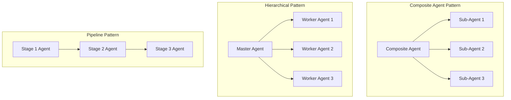
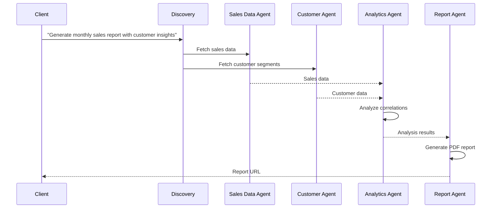

# Stage 7: Advanced Features and Examples

## Overview

Stage 7 showcases advanced features, real-world examples, and optimization strategies for the AOA system. This stage demonstrates the full potential of the architecture through complex use cases.

## Advanced Agent Patterns

### Composite Agents


### Implementing Composite Agents
```python
class CompositeAgent(BaseAgent):
    """Agent that coordinates multiple sub-agents for complex tasks"""
    
    def __init__(self, agent_id: str, config: AgentConfig):
        super().__init__(agent_id, config)
        self.sub_agents = {}
        
    async def register_sub_agent(self, role: str, agent: BaseAgent):
        """Register a sub-agent with a specific role"""
        self.sub_agents[role] = agent
        await agent.initialize()
        
    async def execute(self, task: Task) -> TaskResult:
        """Execute task by delegating to appropriate sub-agents"""
        
        # Analyze task to determine required sub-agents
        execution_plan = await self._create_execution_plan(task)
        
        results = {}
        for step in execution_plan:
            sub_agent = self.sub_agents.get(step.role)
            if not sub_agent:
                raise ValueError(f"No sub-agent for role: {step.role}")
                
            # Execute sub-task
            sub_result = await sub_agent.execute(step.sub_task)
            results[step.role] = sub_result
            
        # Aggregate results
        return self._aggregate_results(results, task)
```

## Industry-Specific Examples

### 1. E-Commerce Analytics Pipeline



Implementation:
```python
class ECommerceAnalyticsWorkflow:
    async def monthly_sales_report(self, month: str, year: int):
        """Generate comprehensive monthly sales report"""
        
        workflow = {
            "intent": f"Generate sales report for {month} {year}",
            "steps": [
                {
                    "agent": "sales-data-agent",
                    "task": "fetch_monthly_sales",
                    "params": {"month": month, "year": year}
                },
                {
                    "agent": "customer-data-agent",
                    "task": "fetch_customer_segments",
                    "params": {"active_in_month": f"{year}-{month}"}
                },
                {
                    "agent": "analytics-agent",
                    "task": "analyze_sales_patterns",
                    "params": {
                        "sales_data": "${steps[0].result}",
                        "customer_data": "${steps[1].result}"
                    },
                    "dependencies": ["step-0", "step-1"]
                },
                {
                    "agent": "visualization-agent",
                    "task": "create_dashboard",
                    "params": {
                        "analysis": "${steps[2].result}",
                        "charts": ["revenue_trend", "category_breakdown", "customer_heatmap"]
                    },
                    "dependencies": ["step-2"]
                }
            ]
        }
        
        return await self.execute_workflow(workflow)
```

### 2. Financial Risk Assessment

```python
class FinancialRiskAssessment:
    """Complex financial risk assessment using multiple specialized agents"""
    
    async def assess_portfolio_risk(self, portfolio_id: str):
        workflow = ExecutionPlan(
            plan_id=f"risk-assessment-{portfolio_id}",
            intent="Comprehensive portfolio risk assessment",
            strategy=ExecutionStrategy.PARALLEL,
            steps=[
                # Parallel data gathering
                AgentStep(
                    step_id="market-data",
                    agent_id="market-data-agent",
                    task_type="fetch_market_data",
                    parameters={"symbols": "${portfolio.symbols}", "period": "1Y"}
                ),
                AgentStep(
                    step_id="credit-scores",
                    agent_id="credit-agent",
                    task_type="fetch_credit_ratings",
                    parameters={"entities": "${portfolio.entities}"}
                ),
                AgentStep(
                    step_id="macro-indicators",
                    agent_id="macro-agent",
                    task_type="fetch_economic_indicators",
                    parameters={"indicators": ["GDP", "inflation", "interest_rates"]}
                ),
                # Risk calculations (depends on data)
                AgentStep(
                    step_id="var-calculation",
                    agent_id="risk-calc-agent",
                    task_type="calculate_var",
                    parameters={
                        "market_data": "${market-data.result}",
                        "confidence": 0.95
                    },
                    dependencies=["market-data"]
                ),
                # Final report
                AgentStep(
                    step_id="risk-report",
                    agent_id="report-agent",
                    task_type="generate_risk_report",
                    parameters={
                        "var": "${var-calculation.result}",
                        "credit": "${credit-scores.result}",
                        "macro": "${macro-indicators.result}"
                    },
                    dependencies=["var-calculation", "credit-scores", "macro-indicators"]
                )
            ]
        )
        
        return await self.workflow_engine.execute_plan(workflow)
```

### 3. Healthcare Data Pipeline

```python
class HealthcareDataPipeline:
    """HIPAA-compliant healthcare data processing pipeline"""
    
    async def patient_outcome_analysis(self, study_params: Dict):
        # Define secure, compliant workflow
        workflow = {
            "security_context": {
                "compliance": ["HIPAA", "GDPR"],
                "encryption": "AES-256",
                "audit_logging": True
            },
            "steps": [
                {
                    "agent": "secure-data-agent",
                    "task": "extract_patient_data",
                    "params": {
                        "criteria": study_params,
                        "deidentify": True
                    }
                },
                {
                    "agent": "medical-nlp-agent",
                    "task": "extract_clinical_notes",
                    "params": {
                        "data": "${steps[0].result}",
                        "extract": ["diagnoses", "treatments", "outcomes"]
                    }
                },
                {
                    "agent": "statistical-agent",
                    "task": "survival_analysis",
                    "params": {
                        "clinical_data": "${steps[1].result}",
                        "methods": ["kaplan_meier", "cox_regression"]
                    }
                },
                {
                    "agent": "compliance-agent",
                    "task": "audit_and_redact",
                    "params": {
                        "report": "${steps[2].result}",
                        "compliance_rules": ["HIPAA", "IRB"]
                    }
                }
            ]
        }
```

## Performance Optimization

### Caching Strategies

```python
class CachedAgent(BaseAgent):
    """Agent with intelligent caching capabilities"""
    
    def __init__(self, agent_id: str, config: AgentConfig):
        super().__init__(agent_id, config)
        self.cache = RedisCache()
        self.cache_ttl = config.cache_ttl or 3600
        
    async def execute(self, task: Task) -> TaskResult:
        # Generate cache key
        cache_key = self._generate_cache_key(task)
        
        # Check cache
        cached_result = await self.cache.get(cache_key)
        if cached_result and self._is_cache_valid(cached_result):
            return TaskResult.from_cache(cached_result)
            
        # Execute task
        result = await super().execute(task)
        
        # Cache result if successful
        if result.status == "success":
            await self.cache.set(
                cache_key, 
                result.to_dict(), 
                ttl=self.cache_ttl
            )
            
        return result
        
    def _generate_cache_key(self, task: Task) -> str:
        """Generate deterministic cache key from task"""
        task_hash = hashlib.sha256(
            json.dumps(task.dict(), sort_keys=True).encode()
        ).hexdigest()
        return f"agent:{self.id}:task:{task_hash}"
```

### Parallel Processing

```python
class ParallelProcessingAgent(BaseAgent):
    """Agent that processes data in parallel chunks"""
    
    async def execute_large_dataset(self, task: Task) -> TaskResult:
        dataset = task.parameters["dataset"]
        chunk_size = task.parameters.get("chunk_size", 1000)
        
        # Split dataset into chunks
        chunks = [
            dataset[i:i + chunk_size] 
            for i in range(0, len(dataset), chunk_size)
        ]
        
        # Process chunks in parallel
        tasks = [
            self._process_chunk(chunk, task.parameters)
            for chunk in chunks
        ]
        
        results = await asyncio.gather(*tasks)
        
        # Merge results
        merged_result = self._merge_results(results)
        
        return TaskResult(
            task_id=task.id,
            status="success",
            data=merged_result,
            metadata={
                "chunks_processed": len(chunks),
                "parallel_execution": True
            }
        )
```

### Resource Management

```python
class ResourceManagedAgent(BaseAgent):
    """Agent with resource limits and management"""
    
    def __init__(self, agent_id: str, config: AgentConfig):
        super().__init__(agent_id, config)
        self.semaphore = asyncio.Semaphore(config.max_concurrent_tasks)
        self.memory_limit = config.memory_limit_mb * 1024 * 1024
        
    async def execute(self, task: Task) -> TaskResult:
        async with self.semaphore:
            # Check memory usage
            if self._get_memory_usage() > self.memory_limit * 0.9:
                await self._cleanup_resources()
                
            return await super().execute(task)
            
    def _get_memory_usage(self) -> int:
        """Get current memory usage in bytes"""
        import psutil
        process = psutil.Process()
        return process.memory_info().rss
```

## Advanced MCP Tools

### Custom MCP Tool Development

```python
class AdvancedMLTool(MCPTool):
    """Advanced machine learning MCP tool"""
    
    schema = MCPToolSchema(
        name="advanced_ml_predict",
        description="Run ML predictions with model selection and hyperparameter tuning",
        parameters={
            "type": "object",
            "properties": {
                "data": {
                    "type": "array",
                    "description": "Input data for prediction"
                },
                "model_type": {
                    "type": "string",
                    "enum": ["random_forest", "xgboost", "neural_network"],
                    "description": "Type of model to use"
                },
                "auto_tune": {
                    "type": "boolean",
                    "description": "Whether to perform hyperparameter tuning"
                },
                "optimization_metric": {
                    "type": "string",
                    "description": "Metric to optimize during tuning"
                }
            }
        }
    )
    
    async def execute(self, params: Dict[str, Any]) -> Dict[str, Any]:
        # Load or train model
        model = await self._get_or_train_model(
            params["model_type"],
            params.get("auto_tune", False)
        )
        
        # Make predictions
        predictions = model.predict(params["data"])
        
        # Calculate confidence scores
        if hasattr(model, "predict_proba"):
            confidence = model.predict_proba(params["data"])
        else:
            confidence = None
            
        return {
            "predictions": predictions.tolist(),
            "confidence": confidence.tolist() if confidence is not None else None,
            "model_info": {
                "type": params["model_type"],
                "parameters": model.get_params(),
                "performance_metrics": self._get_model_metrics(model)
            }
        }
```

## Monitoring and Analytics

### Advanced Metrics Dashboard

```python
class AOAMetricsDashboard:
    """Real-time metrics dashboard for AOA system"""
    
    def __init__(self):
        self.metrics = {
            "agent_performance": {},
            "workflow_analytics": {},
            "resource_utilization": {},
            "error_tracking": {}
        }
        
    async def collect_metrics(self):
        """Collect real-time metrics from all components"""
        
        # Agent performance metrics
        for agent in await self.registry.list_active_agents():
            self.metrics["agent_performance"][agent.id] = {
                "requests_per_second": await self._get_agent_rps(agent.id),
                "average_latency": await self._get_agent_latency(agent.id),
                "error_rate": await self._get_agent_error_rate(agent.id),
                "resource_usage": await self._get_agent_resources(agent.id)
            }
            
        # Workflow analytics
        self.metrics["workflow_analytics"] = {
            "active_workflows": await self._count_active_workflows(),
            "completion_rate": await self._calculate_completion_rate(),
            "average_duration": await self._calculate_avg_duration(),
            "bottlenecks": await self._identify_bottlenecks()
        }
```

## Best Practices

### 1. Agent Design Principles
- **Single Responsibility**: Each agent should have one clear purpose
- **Stateless Operations**: Agents should not maintain state between requests
- **Idempotent Tasks**: Tasks should produce the same result if executed multiple times
- **Clear Interfaces**: Well-defined input/output schemas

### 2. Error Handling
- **Graceful Degradation**: System should continue functioning even if some agents fail
- **Circuit Breakers**: Prevent cascading failures
- **Retry Strategies**: Intelligent retry with exponential backoff
- **Fallback Mechanisms**: Alternative paths when primary fails

### 3. Performance Guidelines
- **Caching**: Cache expensive operations at multiple levels
- **Batch Processing**: Group similar operations together
- **Async Everything**: Use async/await throughout
- **Resource Pooling**: Reuse connections and resources

### 4. Security Considerations
- **Zero Trust**: Verify every request between agents
- **Encryption**: Encrypt data in transit and at rest
- **Audit Logging**: Log all operations for compliance
- **Principle of Least Privilege**: Minimal permissions for each agent

## Deployment Strategies

### Blue-Green Deployment
```yaml
# Blue environment (current)
blue:
  agents:
    - analytics-agent-v1.0
    - data-agent-v1.0
  traffic_weight: 100

# Green environment (new)
green:
  agents:
    - analytics-agent-v1.1
    - data-agent-v1.1
  traffic_weight: 0

# Gradual rollout
rollout_stages:
  - weight: 10  # 10% to green
    duration: 1h
    metrics_check: true
  - weight: 50  # 50% to green
    duration: 2h
    metrics_check: true
  - weight: 100 # 100% to green
    duration: 0
    metrics_check: false
```

## Conclusion

The Agent Oriented Architecture provides a powerful, flexible foundation for building complex AI systems. By following the patterns and practices outlined in this implementation plan, you can create scalable, maintainable, and efficient agent-based systems.

### Key Takeaways
1. **Modular Design**: Agents enable true modularity in AI systems
2. **Scalability**: The architecture scales horizontally with ease
3. **Flexibility**: New capabilities can be added without disrupting existing ones
4. **Maintainability**: Individual agents can be updated independently
5. **Observability**: Rich monitoring and debugging capabilities

### Future Enhancements
- **Federated Learning**: Agents that can learn from distributed data
- **Multi-Modal Agents**: Support for image, audio, and video processing
- **Edge Deployment**: Agents running on edge devices
- **Quantum Integration**: Quantum computing agents for specific tasks

## Resources

- [AOA GitHub Repository](https://github.com/your-org/aoa)
- [API Documentation](https://docs.aoa.dev)
- [Community Forum](https://community.aoa.dev)
- [Training Materials](https://learn.aoa.dev) 